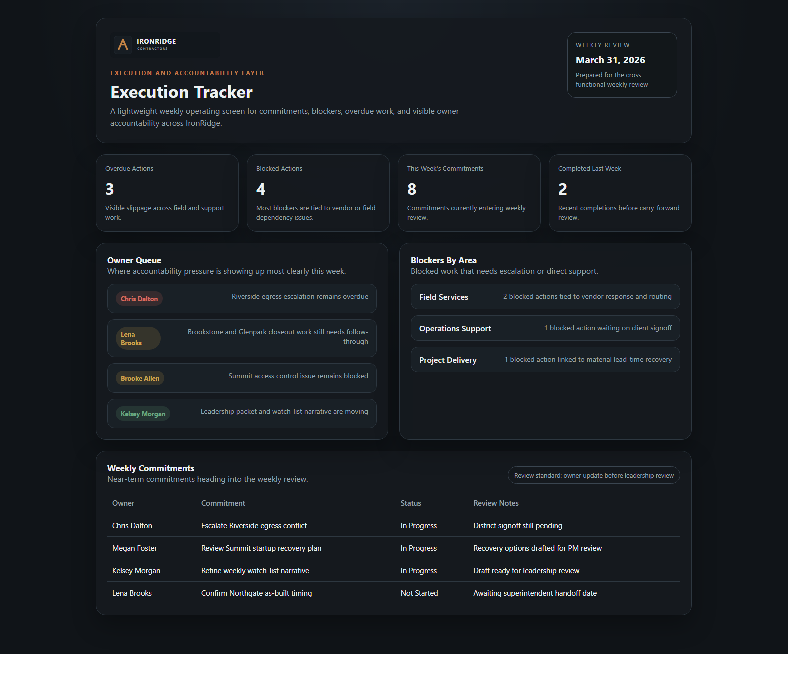
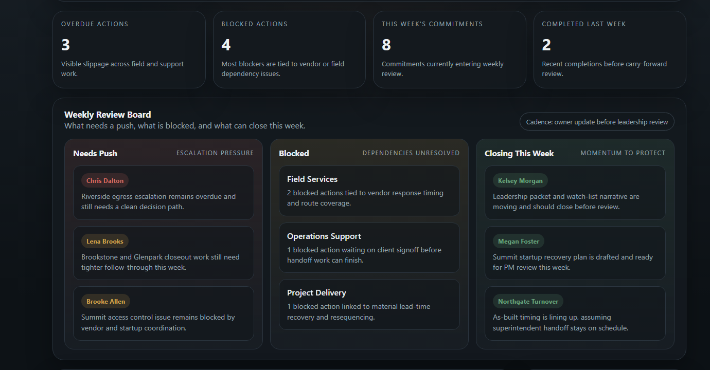

# IronRidge Execution Tracker

## Overview

This repo shows what cleaner follow-through can look like when commitments, owners, blockers, due dates, and weekly review all live in one place.

The IronRidge Execution Tracker is meant to feel like operating infrastructure, not theory. It is the part of the ecosystem that keeps work from disappearing after the meeting ends.

## Business Problem

Leadership and operations meetings generate action items, but cross-department follow-through slips when commitments are scattered across notes, inboxes, and memory. Teams need a practical way to see overdue work, blocked items, and near-term commitments before execution drift becomes a project problem.

## What This Repo Adds

This repo models a disciplined but lightweight execution layer using shared action data, weekly commitments, cadence documentation, and a static review mock. The goal is visible accountability without turning the process into bureaucracy.

## Screenshots

### Overview

### Detail View

## Ecosystem Context

This repo represents the follow-through layer in the broader IronRidge demo ecosystem. Requests originating in `workflow-drag-reduction-demo` can become tracked commitments here, field conditions from `contractor-ops-system-demo` can surface as blockers or escalations, and execution drift can roll up into the executive signals shown in `ops-visibility-demo`.

## Repository Structure

- `docs/` overview, business context, architecture, review cadence, diagrams, and ecosystem framing
- `data/raw/` employees, projects, action items, and weekly commitments
- `data/curated/` overdue, blocker, and completion summaries
- `data/sample_exports/` condensed weekly review export
- `src/execution-mock/` static execution tracker mock for walkthroughs and screenshots
- `assets/` shared visual assets including the IronRidge wordmark
- `notes/` roadmap and screenshot planning

## Data And Sample Assets

The raw layer focuses on ownership, due dates, blocker flags, project linkage, and commitment review notes. Curated outputs condense that detail into the kinds of summaries an operations leader would actually use in a weekly review.

## Mock Experience

The mock tracker emphasizes overdue work, owner accountability, blocker visibility, and weekly commitments. It should feel like a realistic internal review screen for an operations leader, not a generic project-management template.

## Example Record Flow

The cleanest lineage example in this repo is `AI-502`, tied to `IR-103 | Riverside Schools Facility Upgrade`.

- The action exists because `REQ-617` in `workflow-drag-reduction-demo` made the egress problem visible as formal work.
- It stays alive here through owner accountability, overdue pressure, and weekly review notes instead of disappearing after discussion.
- The same underlying condition is visible as `FI-305` in `contractor-ops-system-demo` and contributes directly to Riverside showing up as the clearest escalation case in `ops-visibility-demo`.

The weekly review board also carries the connected Glenpark closeout thread through `AI-509` and the Cedar Hill route strain through `AI-504`.

## Future Enhancements

- add simple carry-forward logic for incomplete commitments
- introduce manager and department workload views
- expand blocker classification and escalation history
- connect meeting source notes to action creation

## Fictional Demo Notice

This repository is part of a fictional IronRidge Contractors environment built to show reporting, workflow, execution, and field operations design. The names and records are made up. The operating patterns are familiar.
